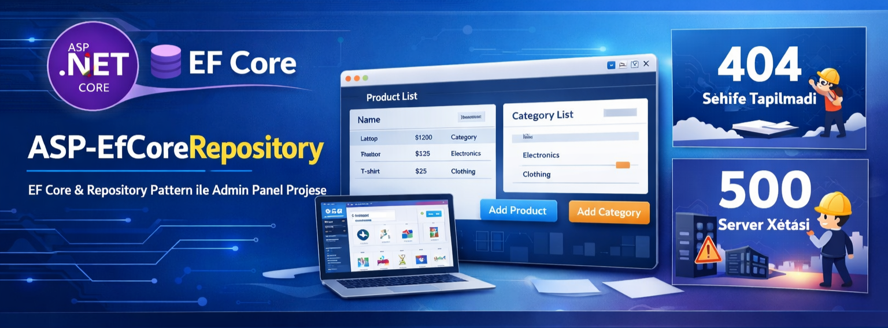

# ASP-EfCoreRepository

ASP.NET Core MVC layihəsi.  
EF Core **Code First** və **Repository Pattern** istifadə olunub.  
Məqsəd: DbContext-i birbaşa controller-də işlətmədən, səliqəli CRUD arxitekturası qurmaq.

## Features
- EF Core Code First + Migrations
- Repository Pattern (User, Product, Category, Order, Favorite)
- Admin Panel (Bootstrap 5)
- Product & Category CRUD
- Custom Error Pages (404 / 500)

## Admin Routes
- Dashboard: `/Admin/Index`
- Products: `/Admin/ProductList`
- Categories: `/Admin/CategoryList`
- Add Product: `/Admin/AddProduct`
- Add Category: `/Admin/AddCategory`

## Setup
**ConnectionString**
```json
"ConnectionStrings": {
  "SqlServer": "Data Source=(localdb)\\MSSQLLocalDB;Initial Catalog=EfCoreStoreDB;Integrated Security=True;TrustServerCertificate=True;"
}
